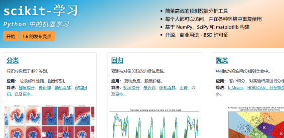

[官网](https://scikit-learn.org/stable/index.html)



[一些例子](kaggle\taitanic)


`scikit-learn`（简称 `sklearn`）是 Python 中一个广泛使用的机器学习库，它建立在 NumPy、SciPy 和 matplotlib 等科学计算库之上，提供了简单而高效的数据挖掘和数据分析工具。`sklearn` 适用于各种机器学习任务，包括分类、回归、聚类、降维、模型选择和预处理等。

### 主要模块

以下是 `scikit-learn` 的主要模块及其功能：

#### 1. **数据预处理（`sklearn.preprocessing`）**

* 提供数据标准化、归一化、编码等工具。
* 常用方法：
  * `StandardScaler`：将特征缩放到均值为 0，标准差为 1。
  * `MinMaxScaler`：将特征缩放到指定范围（如 [0, 1]）。
  * `OneHotEncoder`：将分类变量转换为独热编码。
  * `LabelEncoder`：将标签转换为整数编码。

#### 2. **特征选择（`sklearn.feature_selection`）**

* 提供选择重要特征的方法，减少数据维度。
* 常用方法：
  * `SelectKBest`：选择得分最高的 K 个特征。
  * `chi2`、`f_classif`：用于特征选择的统计检验。
  * `RFE`（递归特征消除）：基于模型的特征选择。

#### 3. **特征提取（`sklearn.feature_extraction`）**

* 提供从原始数据中提取特征的方法。
* 常用方法：
  * `DictVectorizer`：将字典格式的数据转换为特征矩阵。
  * `CountVectorizer`、`TfidfTransformer`：用于文本数据的特征提取。

#### 4. **分类（`sklearn.classification`）**

* 提供多种分类算法。
* 常用算法：
  * `LogisticRegression`：逻辑回归。
  * `SVC`（支持向量机）：适用于二分类和多分类。
  * `RandomForestClassifier`：随机森林分类器。
  * `KNeighborsClassifier`：K 最近邻分类器。
  * `DecisionTreeClassifier`：决策树分类器。

#### 5. **回归（`sklearn.regression`）**

* 提供多种回归算法。
* 常用算法：
  * `LinearRegression`：线性回归。
  * `Ridge`、`Lasso`：带正则化的线性回归。
  * `RandomForestRegressor`：随机森林回归器。
  * `SVR`（支持向量回归）：基于支持向量机的回归。

#### 6. **聚类（`sklearn.cluster`）**

* 提供无监督学习的聚类算法。
* 常用算法：
  * `KMeans`：K 均值聚类。
  * `DBSCAN`：基于密度的聚类算法。
  * `AgglomerativeClustering`：层次聚类。

#### 7. **降维（`sklearn.decomposition` 和 `sklearn.manifold`）**

* 提供降维算法，用于减少数据的特征数量。
* 常用方法：
  * `PCA`（主成分分析）：线性降维方法。
  * `KernelPCA`：非线性降维方法。
  * `TSNE`：t-分布随机邻域嵌入，用于高维数据的可视化。

#### 8. **模型选择与评估（`sklearn.model_selection` 和 `sklearn.metrics`）**

* 提供模型训练、验证和评估的工具。
* 常用方法：
  * `train_test_split`：将数据集划分为训练集和测试集。
  * `cross_val_score`：交叉验证。
  * `GridSearchCV`、`RandomizedSearchCV`：超参数调优。
  * `accuracy_score`、`precision_score`、`recall_score`、`f1_score`：分类评估指标。
  * `mean_squared_error`、`r2_score`：回归评估指标。

#### 9. **集成学习（`sklearn.ensemble`）**

* 提供集成学习算法，结合多个模型以提高性能。
* 常用算法：
  * `RandomForestClassifier`、`RandomForestRegressor`：随机森林。
  * `GradientBoostingClassifier`、`GradientBoostingRegressor`：梯度提升。
  * `AdaBoostClassifier`、`AdaBoostRegressor`：自适应增强。
  * `VotingClassifier`：投票分类器。

#### 10. **半监督学习（`sklearn.semi_supervised`）**

* 提供半监督学习算法，结合少量标记数据和大量未标记数据。
* 常用算法：
  * `LabelPropagation`、`LabelSpreading`：标签传播算法。

### 示例代码

以下是一个简单的示例，使用 `sklearn` 进行分类任务：

```python
from sklearn.datasets import load_iris
from sklearn.model_selection import train_test_split
from sklearn.preprocessing import StandardScaler
from sklearn.linear_model import LogisticRegression
from sklearn.metrics import accuracy_score

# 加载数据集
data = load_iris()
X, y = data.data, data.target

# 数据集划分
X_train, X_test, y_train, y_test = train_test_split(X, y, test_size=0.2, random_state=42)

# 数据预处理
scaler = StandardScaler()
X_train = scaler.fit_transform(X_train)
X_test = scaler.transform(X_test)

# 训练模型
model = LogisticRegression(max_iter=200)
model.fit(X_train, y_train)

# 预测与评估
y_pred = model.predict(X_test)
print(f"Accuracy: {accuracy_score(y_test, y_pred):.2f}")
```

### 优点

1. **易用性** ：API 设计简洁，易于上手。
2. **高效性** ：底层实现使用 C 和 Cython，性能优异。
3. **丰富的文档** ：提供详细的文档和示例代码。
4. **社区活跃** ：拥有庞大的用户和开发者社区，持续更新和维护。

### 缺点

1. **不适合大规模数据** ：对于非常大的数据集，`sklearn` 的性能可能不如分布式计算框架（如 Spark MLlib）。
2. **缺乏深度学习支持** ：不支持深度学习模型，需结合 TensorFlow 或 PyTorch 使用。

### 总结

`scikit-learn` 是一个功能强大且易于使用的机器学习库，适合初学者和专业人士。无论是数据预处理、模型训练还是评估，`sklearn` 都提供了丰富的工具，能够满足大多数机器学习任务的需求。
