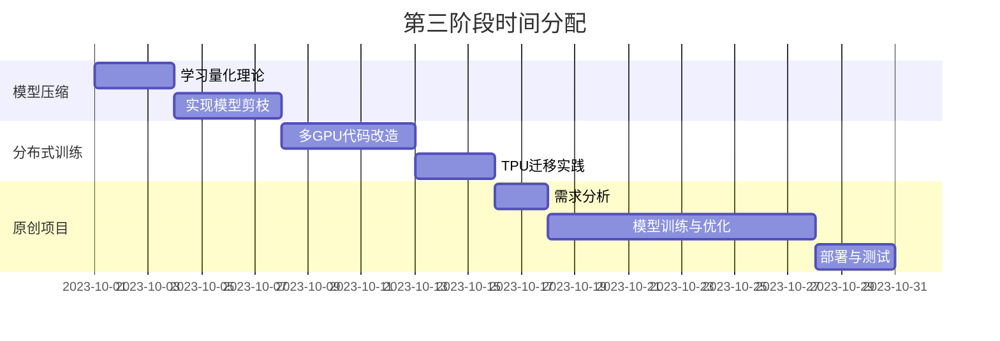

---

---
[PyTorch 教程](https://pytorch.org/tutorials/)

[www.tensorflow.org](https://www.tensorflow.org/learn)

[开发人员指南 (keras.io)](https://keras.io/guides/)

### **深度学习高效学习计划（3个月版）**

**目标**：掌握深度学习核心技能，能独立完成从数据准备到模型部署的全流程项目
**每日投入**：2小时（周末可延长至4小时）
**核心原则**：**70%实践 + 20%调试 + 10%理论**

### **第一阶段：基础奠基（第1-2周）✅✅✅✅✅**

#### **学习目标✅✅✅✅✅**

1. 理解深度学习基础概念（前向传播、损失函数、优化器）
2. 掌握PyTorch/TensorFlow基础API
3. 完成第一个可运行的图像分类模型

#### **每日任务✅✅✅✅✅**

| 时间    | 内容                                                       | 产出                    |
| ------- | ---------------------------------------------------------- | ----------------------- |
| 第1天   | 安装环境（Anaconda+PyTorch/TF），运行官方"Hello World"示例 | 成功打印"Hello Tensor"  |
| 第2-3天 | 学习张量操作（创建、切片、广播），对比NumPy实现            | 完成5个张量操作练习题   |
| 第4天   | 理解自动微分机制（PyTorch的backward或TF的GradientTape）    | 手动实现简单线性回归    |
| 第5-6天 | 学习数据加载（Dataset/DataLoader或tf.data.Dataset）        | 构建MNIST数据集加载管道 |
| 第7天   | 搭建第一个全连接网络训练MNIST                              | 准确率>85%的模型文件    |

#### **周末任务 ✅✅✅✅✅**

- 必做：复现官方教程中的CNN模型（如LeNet）
- 选做：尝试在Kaggle提交MNIST预测结果完美完成

### **第二阶段：项目实战（第3-6周）**

#### **核心目标**

1. 完成3个不同类型的完整项目
2. 掌握模型调优与调试技巧
3. 学会使用可视化工具

#### **项目安排**

| 周数  | 项目类型 | 技术要点                                        | 交付物                          |
| ----- | -------- | ----------------------------------------------- | ------------------------------- |
| 第3周 | 图像分类 | 数据增强、迁移学习（ResNet）、TensorBoard可视化 | CIFAR10准确率>75%的模型         |
| 第4周 | 文本分类 | 词嵌入（Word2Vec）、LSTM、Attention机制         | IMDB电影评论情感分析（ACC>85%） |
| 第5周 | 目标检测 | YOLOv3/TF Object Detection API                  | 自定义数据集检测结果可视化      |
| 第6周 | 模型部署 | ONNX导出、Flask API部署、Docker打包             | 可访问的HTTP预测接口            |

#### **每日流程**

1. **上午**（30分钟）：阅读相关论文/技术文档（如ResNet论文）
2. **下午**（1.5小时）：
   - 编码实现核心功能
   - 调试模型性能瓶颈
   - 记录实验参数（建议用W&B或MLflow）
3. **晚上**（自主安排）：参与Kaggle竞赛/复现经典论文

#### **周末重点**

- 模型优化：尝试不同的学习率策略（如Warmup）
- 错误分析：可视化混淆矩阵，找出bad case规律

---

### **第三阶段：深度进阶（第7-12周）**

#### **核心目标**

1. 掌握工业级部署与优化技巧
2. 深入理解框架底层原理
3. 完成一个原创项目并开源

#### **学习路线**

| 周数   | 主题       | 具体任务                                      | 工具/技术                             |
| ------ | ---------- | --------------------------------------------- | ------------------------------------- |
| 第7周  | 模型压缩   | 量化（FP16/INT8）、剪枝、知识蒸馏             | PyTorch Quantization/TFMOT            |
| 第8周  | 分布式训练 | 多GPU训练（DDP/Horovod）、TPU使用             | PyTorch Lightning/TF Strategy         |
| 第9周  | 自监督学习 | SimCLR、MAE实现                               | PyTorch Metric Learning/TF Similarity |
| 第10周 | 生产部署   | TorchServe/TensorFlow Serving性能调优         | Prometheus监控、压力测试              |
| 第11周 | 源码贡献   | 阅读PyTorch/TF核心模块代码，提交PR修复简单bug | GitHub开源社区参与                    |
| 第12周 | 毕设级项目 | 从选题到部署的全流程实现（如智能客服系统）    | 技术文档编写 + 演示视频               |

#### **时间分配建议**

---

### **学习资源包**

#### **理论巩固**

- 精读《深度学习》（花书）第6-10章
- 观看CS231n（计算机视觉）和CS224n（自然语言处理）课程

#### **代码库推荐**

- PyTorch模板：[PyTorch-StudioGAN](https://github.com/POSTECH-CVLab/PyTorch-StudioGAN)
- TensorFlow模板：[TF官方模型库](https://github.com/tensorflow/models)

#### **效率工具**

- 调试：PyCharm专业版（远程调试） / VS Code + Jupyter插件
- 协作：GitHub Projects管理任务，Notion记录学习笔记

---

### **关键检查点**

| 时间节点  | 里程碑要求                           | 未达标补救措施                 |
| --------- | ------------------------------------ | ------------------------------ |
| 第2周结束 | MNIST准确率>98%                      | 重学自动微分与优化器原理       |
| 第6周结束 | 至少2个项目部署到本地服务器          | 补充学习Docker和REST API设计   |
| 第9周结束 | 自监督学习项目acc超过基线模型10%     | 调整数据增强策略，增加训练轮次 |
| 结业验收  | GitHub仓库star>50/论文复现获官方认可 | 参与AI比赛积累实战经验         |

---

### **学习心法**

1. **刻意练习**：每天必须写代码，哪怕只是修改超参数
2. **费曼输出**：每周写技术博客（如知乎/Medium）总结知识点
3. **以教促学**：在Stack Overflow回答至少3个相关问题
4. **工具武装**：配置高效的开发环境（终端美化、快捷键优化）

---

**坚持完成此计划后，你将具备以下能力**：
✅ 独立完成工业级深度学习项目开发
✅ 快速复现顶会论文核心算法
✅ 年薪30W+算法岗位竞争力
**最重要的是**：建立起**发现问题 → 设计解决方案 → 迭代优化**的工程思维！
