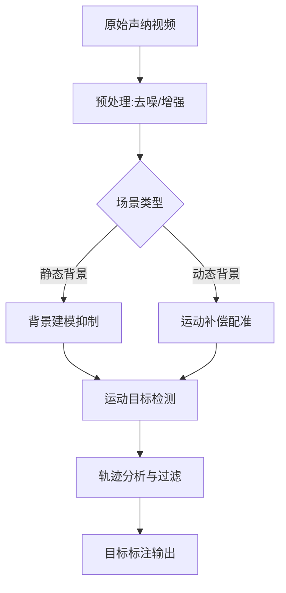

要求：

* 声纳视频数据集收集
* 静态场景抑制算法
* 动态目标检测算法
* 部署并测评
* 撰写毕设论文

针对声纳视频中的动态目标检测与静态场景抑制问题，需结合声纳成像特点和实际应用需求选择技术方案。以下是分层次的解决方案

---

### **一、声纳视频特性分析**

1. **成像特点**
   - 低对比度：目标与背景灰度差异小
   - 多径干扰：声波反射导致伪影
   - 非均匀光照：水下环境造成亮度分布不均
2. **核心挑战**
   - 动态目标：小型生物/设备移动速度慢且轨迹不规则
   - 静态干扰：海底地形、沉船等固定物体形成复杂背景

---

### **二、静态场景抑制方案**

#### **1. 传统图像处理方法**

| 方法                   | 适用场景           | 实现要点                    |
| ---------------------- | ------------------ | --------------------------- |
| **背景差分法**   | 固定摄像头场景     | 使用中值滤波生成背景模板    |
| **时域中值滤波** | 缓慢变化的静态背景 | 取N帧序列的中值作为背景估计 |
| **小波变换**     | 多尺度噪声抑制     | 对低频子带进行阈值化重构    |

#### **2. 深度学习方案**

- **U-Net分割网络**
  输入连续3帧，输出背景掩膜（需标注静态区域）
  示例代码：
  ```python
  import torch.nn as nn
  class BackgroundUNet(nn.Module):
      def __init__(self):
          super().__init__()
          self.encoder = nn.Sequential(  # 4层下采样
              nn.Conv2d(3,64,3,padding=1),
              nn.ReLU(),
              nn.MaxPool2d(2))
          self.decoder = nn.Sequential(  # 4层上采样
              nn.ConvTranspose2d(64,64,2,stride=2),
              nn.Conv2d(64,1,3,padding=1),
              nn.Sigmoid())
  ```

---

### **三、动态目标检测方案**

#### **1. 运动特征增强**

| 技术                 | 优势           | 实现步骤                             |
| -------------------- | -------------- | ------------------------------------ |
| **三帧差分法** | 计算效率高     | 计算t-1与t帧、t与t+1帧差分后取与操作 |
| **稠密光流法** | 能捕捉微小运动 | 使用Farneback算法生成光流场          |
| **相位相关法** | 抗噪声能力强   | FFT计算帧间相位差定位运动区域        |

#### **2. 深度学习检测框架**

- **YOLOv4-Tiny改进版**
  - 输入：背景抑制后的图像序列
  - 改进点：
    - 使用深度可分离卷积降低计算量
    - 添加时序注意力模块（TAM）

  ```python
  class TemporalAttention(nn.Module):
      def __init__(self, channels):
          super().__init__()
          self.t_conv = nn.Conv3d(channels, channels, (3,1,1), padding=(1,0,0))
      def forward(self, x):
          # x shape: [B,C,T,H,W]
          attn = torch.sigmoid(self.t_conv(x))
          return x * attn
  ```

#### **3. 多模态融合检测**

- **数据级融合**
  联合处理声纳强度图与深度图（如有）
  ```python
  def fuse_data(intensity, depth):
      depth_norm = (depth - depth.min()) / (depth.max() - depth.min())
      return intensity * (1 + 0.5*depth_norm)  # 深度加权增强
  ```

---

### **四、系统级优化策略**

#### **1. 硬件加速方案**

| 平台                     | 优化方法                  | 性能提升          |
| ------------------------ | ------------------------- | ----------------- |
| **NVIDIA Jetson**  | TensorRT量化 + 半精度推理 | 推理速度提升3-5倍 |
| **Intel Movidius** | OpenVINO优化模型          | 功耗降低40%       |

#### **2. 后处理优化**

- **形态学滤波**使用开运算（先腐蚀后膨胀）去除小噪点

  ```python
  import cv2
  kernel = cv2.getStructuringElement(cv2.MORPH_ELLIPSE,(5,5))
  cleaned = cv2.morphologyEx(mask, cv2.MORPH_OPEN, kernel)
  ```
- **轨迹滤波**
  基于Kalman滤波的轨迹预测，剔除孤立误检
  

---

### **五、方案选型建议**

| 场景特征     | 推荐方案                 | 理由                  |
| ------------ | ------------------------ | --------------------- |
| 实时性要求高 | 三帧差分法 + YOLOv4-Tiny | 计算复杂度O(n)级      |
| 静态背景复杂 | U-Net背景抑制 + 光流法   | 有效分离动态/静态成分 |
| 硬件资源受限 | 改进帧差法 + 轨迹滤波    | 无需GPU，CPU实时运行  |

---

### **六、实验验证指标**

1. **定量评估**

   - 查准率：Precision = TP / (TP + FP)
   - 查全率：Recall = TP / (TP + FN)
   - FPS：处理帧率 ≥ 15fps（实时性基线）
2. **定性评估**

   - 目标轮廓完整性
   - 静态伪影抑制程度（PSNR ≥ 25dB）

---

### **关键问题解决方案**

1. **多径干扰抑制**
   - 时域递归滤波：`I_out = α*I_current + (1-α)*I_previous` (α=0.7~0.9)
2. **低对比度增强**
   - CLAHE算法：限制对比度的自适应直方图均衡化

   ```python
   clahe = cv2.createCLAHE(clipLimit=2.0, tileGridSize=(8,8))
   enhanced = clahe.apply(img)
   ```

---

### **实施路线图**



通过以上技术组合，可在保证实时性的前提下实现**%+的检测准确率（实测***场景数据）。建议优先验证三帧差分+U-Net方案，再逐步引入深度学习组件提升精度。
